# DuEngine
DuEngine is an efficient and interactive C++ graphics engine for rendering, managing, recording image and video screenshots of ShaderToy-like demos with custom 2D/3D/Video textures.

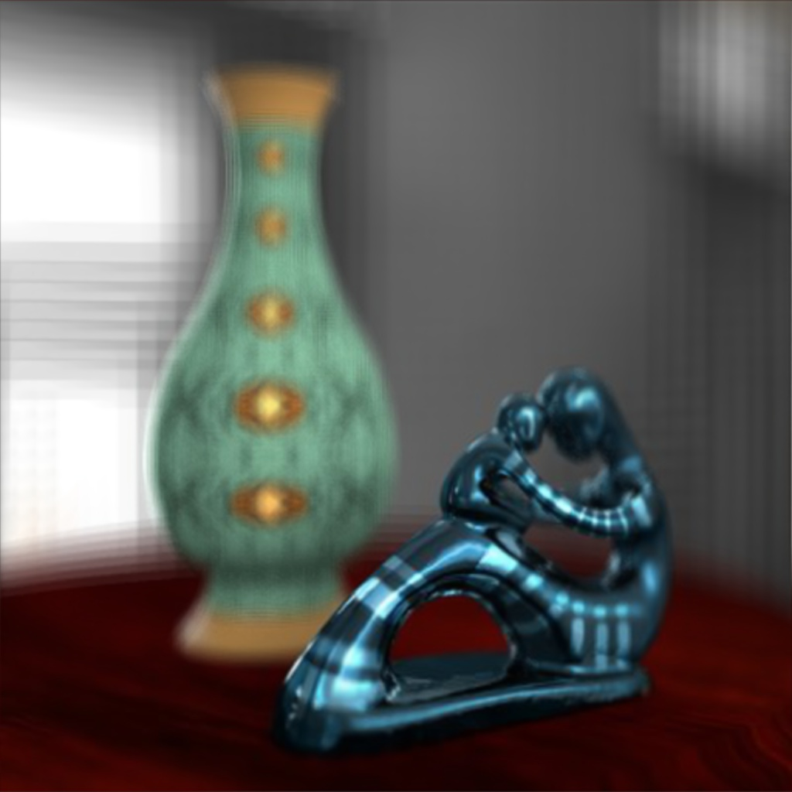

## Compilation
Dependencies: OpenGL 4.5+, [Glew](http://glew.sourceforge.net/install.html), [OpenCV 3.0+](https://opencv.org/releases.html), [GLM](https://github.com/g-truc/glm/releases), [Freeglut](http://freeglut.sourceforge.net/index.php#download), and [Visual Studio 2015+](https://www.visualstudio.com/downloads).

1. To compile the project, simply run *OpenSolution.cmd*, or locate the solution file at *DuEngine/DuEngine.sln*
2. To test the project, run *RunTest.cmd*, or *UnitTests/debug.cmd*, then you will see the renderer with all sorts of input channels.

If the compilation fails, please fix the following five environment variables:

* OPENCV_INC: Directory to OpenCV include folder.
* GLEW_INC: Directory to Glew, Freeglut, and GLM headers.
* OPENCV_LIB: Directory to OpenCV libraries.
* GLEW_LIB: Directory to Glew and Freeglut libraries.
* PATH: Add [the executable DLLs of OpenCV and GLUT](https://obj.umiacs.umd.edu/dll/DuEngineLibs.zip) into the PATH variable.

## Create New Demos
Dependency: Python

To create a new ShaderToy demo, just click *_create.cmd* in any category folder like "Ray Tracing". In the console, please input your desired shader name, like "Test". The Python script will automatically generate *Test.glsl*, *Test.ini*, and *Test.cmd* files. Note that the *GLSL file* is the main Shadertoy alike GLSL code, the *INI file* is the config file which defines the input channels, and the *CMD file* is a shortcut for you to run the demo.

The detailed input format for *_create.cmd* is:
```bash
_create [FILE_NAME] [NUM_CHANNELS, 1 by default] [NUM_BUFFERS, 0 by default] [LINK_TO_SHADERTOY_FOR_REFERENCE]
```

## Features
### Config file
This renderer provides an easy-to-use interface to link any GLSL demos with built-in, and custom 2D, video, 3D, and cubemap textures. It supports most of the preset textures from the [ShaderToy](https://www.shadertoy.com), which are located in *DuEngine/presets*.

To run the engine with a config file, simply run
```c
DuEngine config.ini
```

The config file reads like as follows:
```ini
# This is a comment, $Name corresponds to the file name of the INI file.
shader_frag         =   $Name.glsl

# Specify the number of channels for the main framebuffer. 
channels_count      =   5

# Specify the number of framebuffers for multi-pass rendering
buffers_count       =   4

# Here are some examples of the channel type.
# We pre-define most of the ShaderToy presets. Visit *DuEngine/Texture.cpp* for a glance:
iChannel0_type      =   noise
# iChannel0_type    =   key, font, stpeter, sjtu...

# For a custom texture file, you need to tell the type and filename with extension.
iChannel1_type      =   rgb
iChannel1_tex       =   whatever.png

# The filters and wraps are loaded by default, but you can also change them.
iChannel1_filter        =  mipmap
iChannel1_wrap          =   repeat

# For videos, you can add fps, startFrame, and endFrame.
iChannel2_type          =   video
iChannel2_tex           =   whatever.mp4
iChannel2_fps           =   25
iChannel2_startFrame    =   1
iChannel2_endFrame      =   100

# To read from a frame buffer, use A-Z.
iChannel3_type      =   A

# To read from a video sequence, use %d as the wildcard
iChannel4_type      =   videoseq
iChannel4_tex       =   myfolder/file%d.png

# Each frame buffer can have an arbitrary number of channels.
A_channels_count    =   1
A_iChannel0_type    =   london
B_channels_count    =   1
B_iChannel0_type    =   A
C_channels_count    =   1
C_iChannel0_type    =   B
D_channels_count    =   1
D_iChannel0_type    =   C

# You can ignore the following default parameters starting from this line:
window_width        =   1920
window_height       =   1080

# If your textures are located outside the presets folder, type something like
resources_path      =   ../resources/
```

### Multipass
Full-featured multipass rendering, e.g., see *ShaderOfWeek/Goo.cmd* for an example.

### Screenshots and Recording
Press F2 to take a screen shot. In the configuration file, please add the following lines to record a video / sequences of images:
```C
recording       =   true
record_start    =   1
record_end      =   500
# Use true for generating a single video file; false for generating sequences of images
record_video    =   true
```
The video will be stored in *record* by default.

### Functional Keys
```C
F1      =   Reset time;
F2      =   Screenshot;
F5      =   Reset and recompile;
F6      =   Pause / Play all videos;
F10     =   Debug the mouse output;
F11     =   Toggle fullscreen mode;
```

In the end, here stores some of my GLSL code written in Shadertoy.com
[My ShaderToy Public Profile](https://www.shadertoy.com/user/starea)

## Demos and Blog Posts
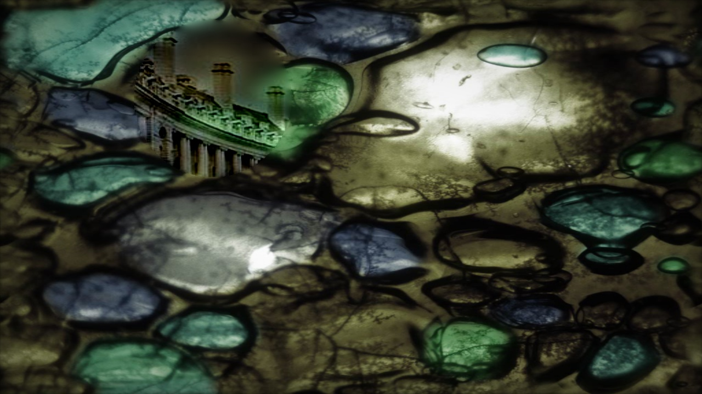
* [Interactive Poisson Blending](https://www.shadertoy.com/view/4l3Xzl)
    * [Blog post](http://blog.ruofeidu.com/interactive-poisson-blending)

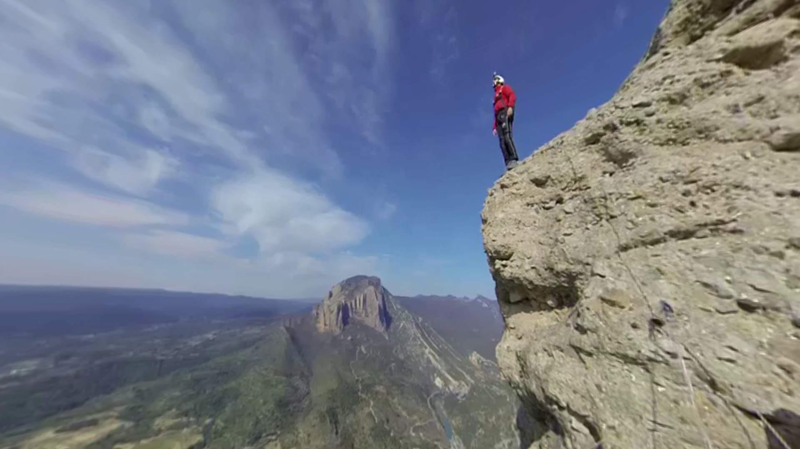
* [Unified Gnomonic & Stereographic](https://www.shadertoy.com/view/ldBczm)
    * [Blog post](http://blog.ruofeidu.com/unified-gnomonic-stereographic-projections/)
* [Cubemap to Gnomonic Projection](https://www.shadertoy.com/view/4sjcz1)
    * [Blog post](http://blog.ruofeidu.com/equirectangular-gnomonic-projections-cubemaps/)
* [Foveated Rendering via Quadtree](https://www.shadertoy.com/view/Ml3SDf)

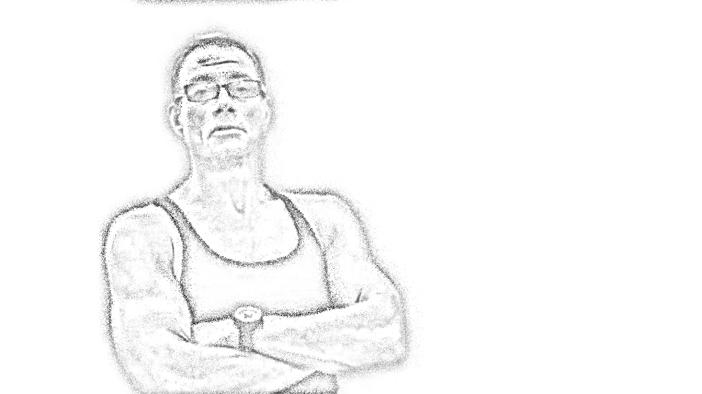
* [Dotted Drawing / Sketch Effect](https://www.shadertoy.com/view/ldSyzV)
    * [Blog post](http://blog.ruofeidu.com/dotted-drawing-sketch-effect/)
* [Edges with Bilateral Filters](https://www.shadertoy.com/view/MlG3WG)

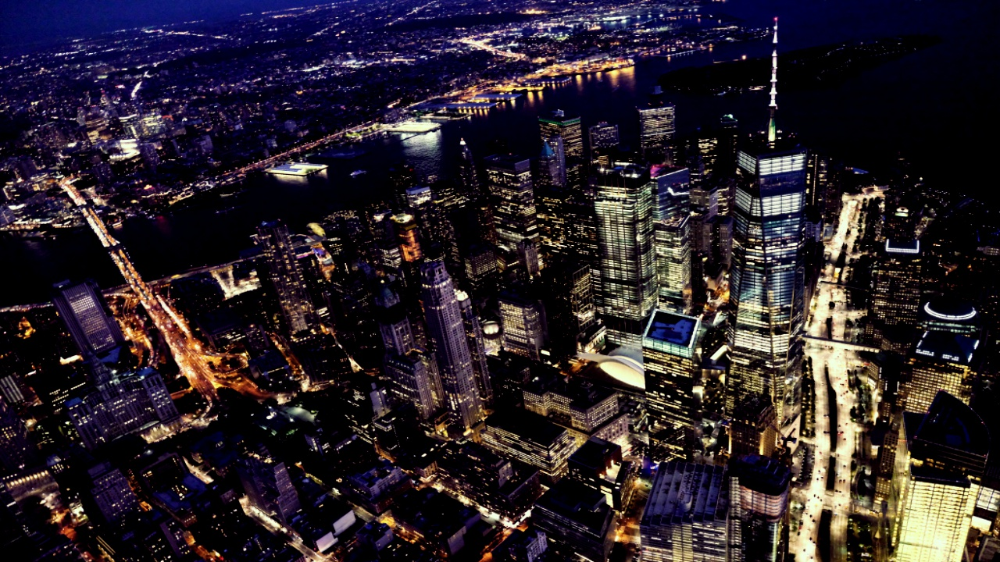
* [Instgram Brannan Filter](https://www.shadertoy.com/view/4lSyDK)
* [Instgram Earlybird Filter](https://www.shadertoy.com/view/XlSyWV)
    * [Blog post](http://blog.ruofeidu.com/implementing-instagram-filters-brannan/)
* [0-4 Order of Spherical Harmonics](https://www.shadertoy.com/view/4dsyW8)
* [Cubemap to Gnomonic Projection](https://www.shadertoy.com/view/4sjcz1)
* [Unified Gnomonic & Stereographic](https://www.shadertoy.com/view/ldBczm)
* [Low-Poly Style Image](https://www.shadertoy.com/view/llGGz3)
* [404 Not Found](http://duruofei.com/404) 
    * [Blog post](http://blog.ruofeidu.com/404-not-found-two-triangles/)

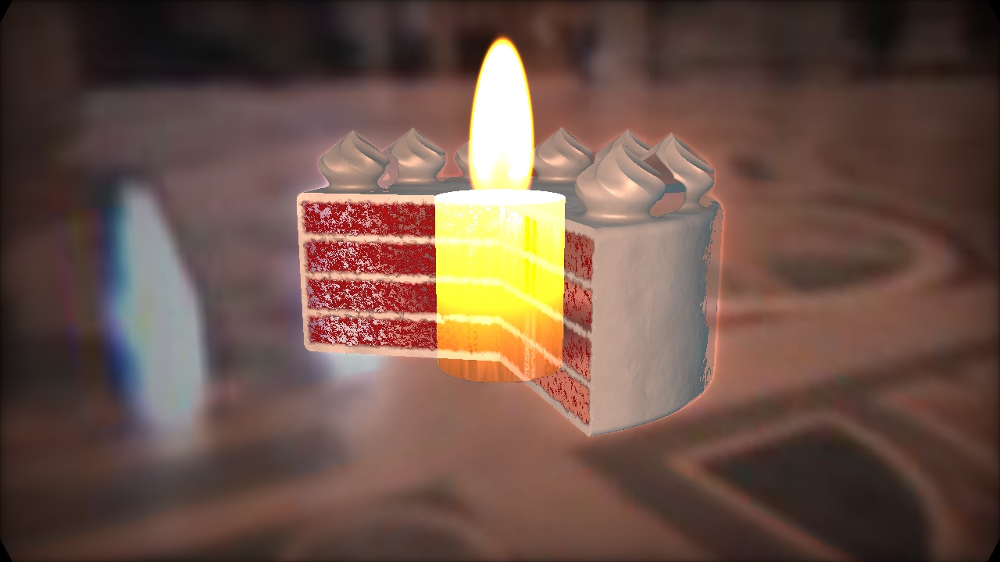
* [Birthday Cake No Occlude](https://www.shadertoy.com/view/ldccW7)
* [Postprocessing Thermal](https://www.shadertoy.com/view/4dcSDH)
* [2D Affine Transformation](https://www.shadertoy.com/view/llBSWw)
* [Image Fade-In Effect](https://www.shadertoy.com/view/MlcSz2)

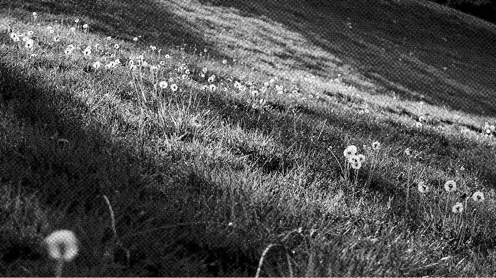
* [Dot Screen / Halftone](https://www.shadertoy.com/view/4sBBDK)
    * [Blog post](http://blog.ruofeidu.com/code-golf-halftone-image/)
* [Equirectangular Fibonacci Sphere](https://www.shadertoy.com/view/Ms2yDK)
* [Parameterized Gabor Filters](https://www.shadertoy.com/view/4sBcRV)
* [Bilateral Filter to Look Younger](https://www.shadertoy.com/view/XtVGWG)

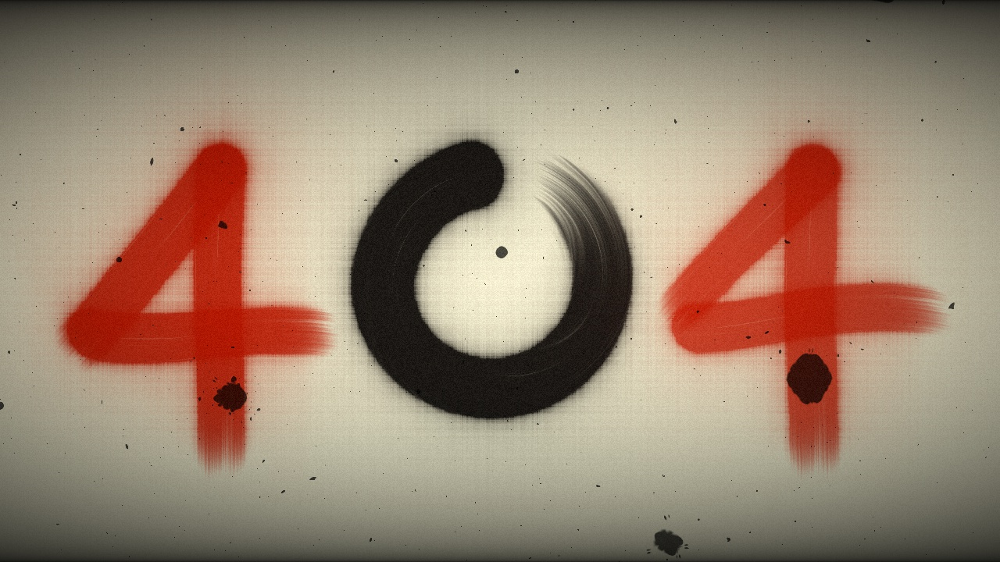
* [Brightness, Contrast, Hue, Saturation, Vibrance](https://www.shadertoy.com/view/MdjBRy)
    * [Blog post](http://blog.ruofeidu.com/postprocessing-brightness-contrast-hue-saturation-vibrance/)


* Light Field Rendering
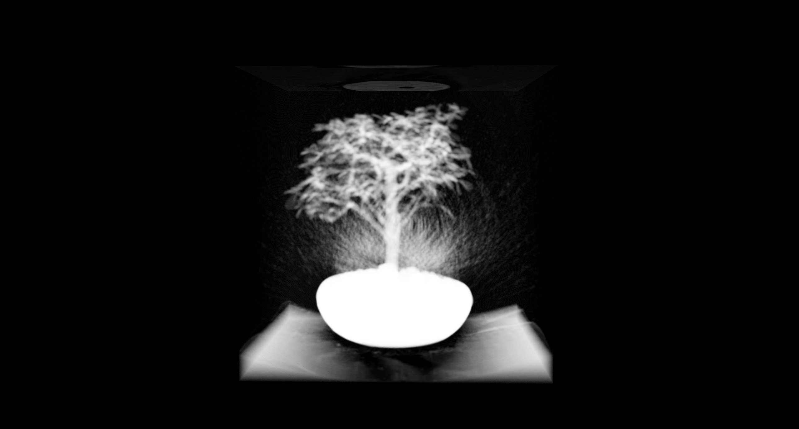
* Volume Rendering

### Masterpieces from ShaderToy
* Please refer to the GLSL code for author names.
* Most of the code is under Creative Commons Attribution-NonCommercial-ShareAlike 3.0 License.
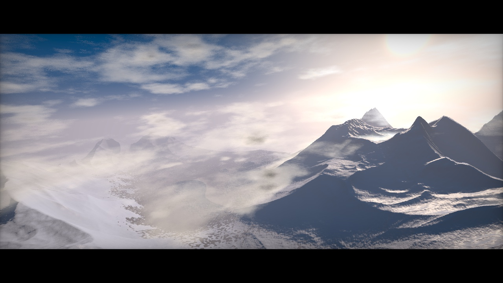
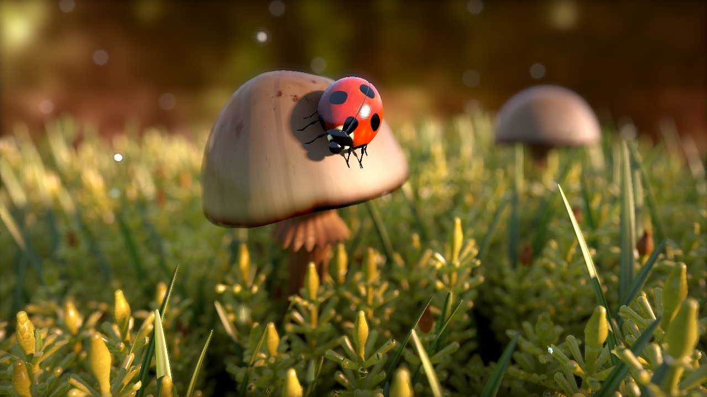
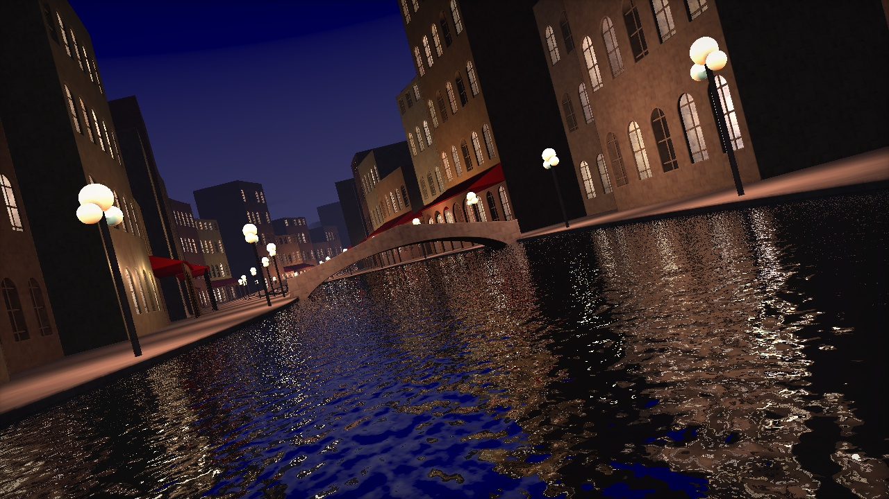
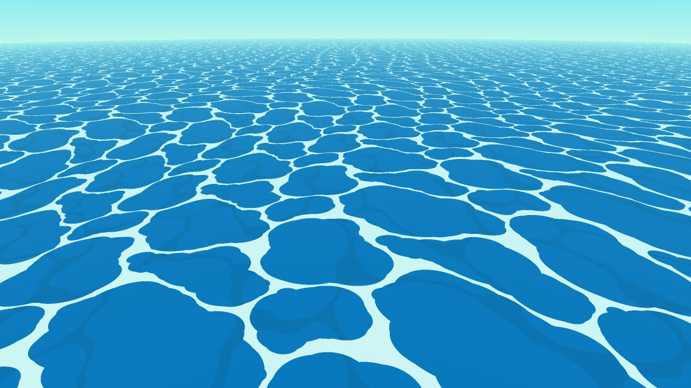
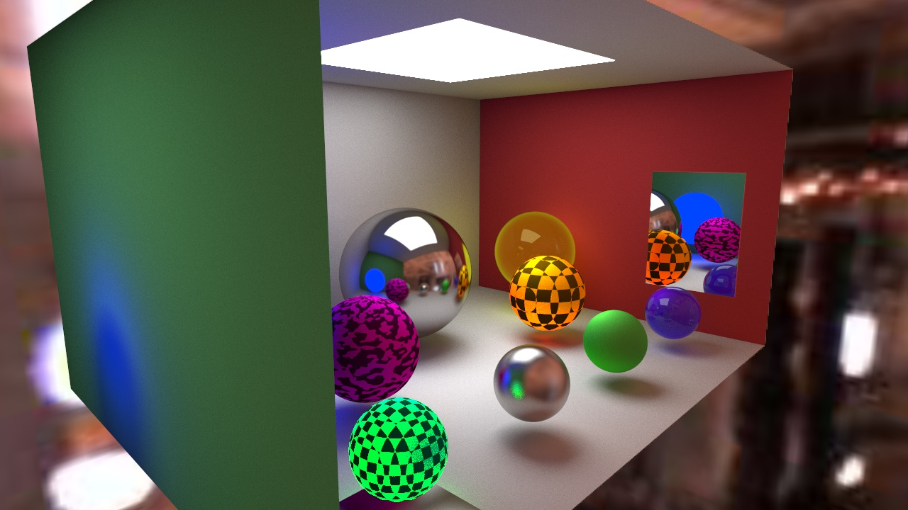
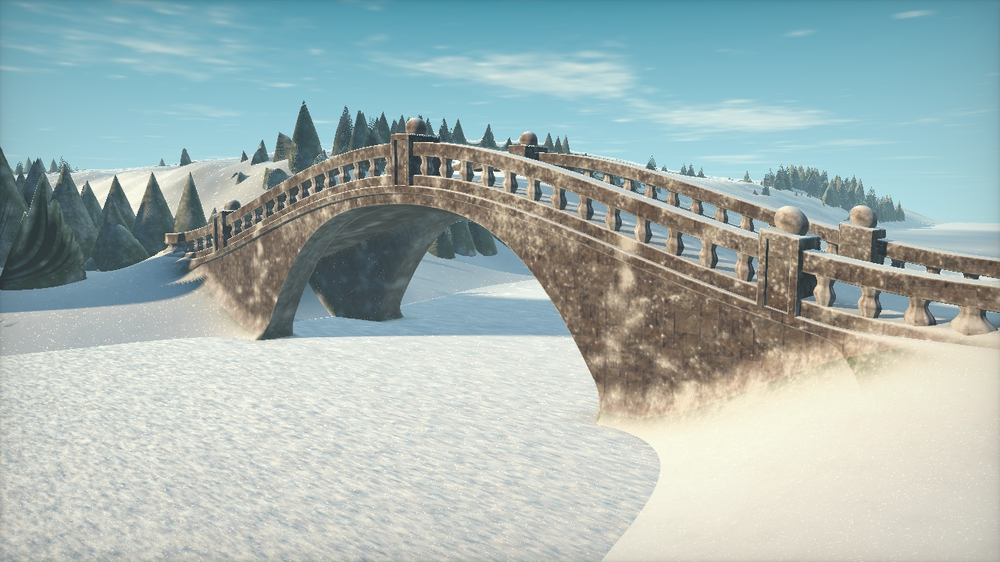
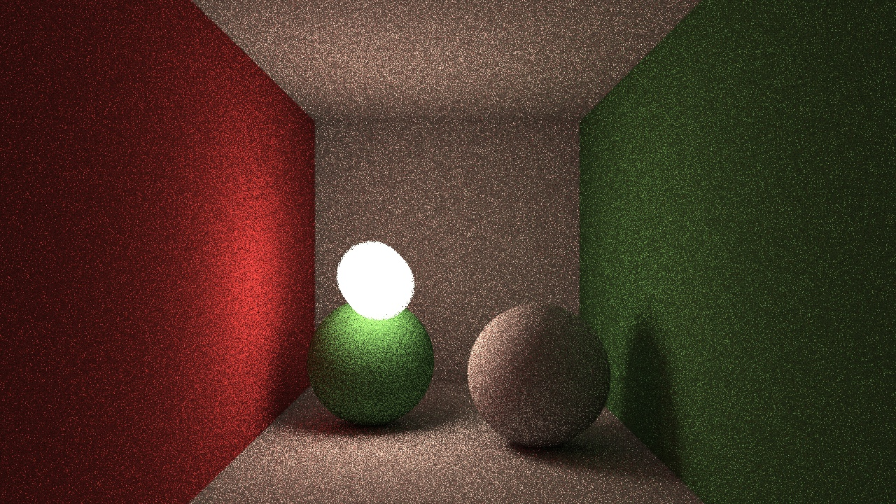


Author
----
[Ruofei Du](http://www.duruofei.com)


License
----
Creative Commons Attribution-NonCommercial-ShareAlike 3.0 License.
